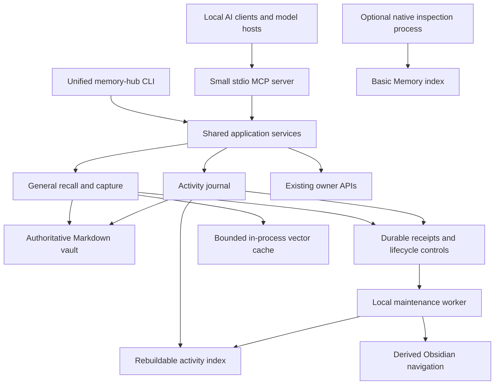

# Local memory improvements: implementation specification

Status: implementation specification. The initial code is implemented; see
[operations and rollout gates](../memory-v2-operations.md). This document does not
establish live activation, client verification, or completion of the observation period.
Date: 2026-09-21. Baseline source: `c6fa580d715cb5d5560cde66b67d09c78d0cb0bd`.

## 1. Outcome and scope

Make the existing hub fast to connect to, reliable during everyday Obsidian edits,
simple to operate, and available consistently across local AI clients. Preserve
Markdown authority, explicit capture policy, source ownership, and verified retries.
Implement the improvements in small, independently reversible changes.

This specification covers all seven findings from the improvement assessment:

| Requirement | Required result | Main sections |
| --- | --- | --- |
| INT-1 | Shared installation, instructions, and verification for supported clients | 4, 5 |
| ACT-1 | Fast activity queries and incremental derived views | 7, 8 |
| REL-1 | Unmanaged notes cannot disable unrelated managed recall | 9 |
| START-1 | Core tools start without native index rebuilds | 6 |
| SEM-1 | Bounded, revision-aware semantic cache survives subject switches | 10 |
| UX-1 | One CLI, typed tools, consistent outcomes and diagnostics | 3, 5, 11 |
| OPS-1 | Capacity, backup, restore, client coverage, and regression checks | 11–15 |

Personal installation inventories, measurements, paths, activation evidence, and
rollout receipts belong in ignored runtime storage. Public fixtures use synthetic
notes and synthetic client homes. This document contains reusable requirements.

The initial supported host is macOS; pure Python contracts and tests remain portable
to the repository's Linux CI. Platform-specific client paths and launchd code live
behind adapters. Do not claim Windows/Linux installation support until tested.

Out of scope: moving the canonical vault, migrating the legacy SQLite package,
copying fitness/skill-owned records into general memory, automatic transcript
ingestion, public endpoints, implicit cloud billing, new model downloads, automatic
off-device uploads, and automatic deletion or archival of existing history.

## 2. Invariants and evidence

The implementation MUST preserve these invariants:

1. Current Markdown supplies note content. Receipts and lifecycle controls supply
   write identity and integrity history. A search index supplies neither authority.
2. General, activity, fitness, and skill-owned records retain separate contracts.
3. Current user instructions override recalled material. Notes are untrusted data.
4. Candidates, overdue evidence, unresolved corrections, and records outside the
   selected scope never become ordinary advice because a cache returned them.
5. Deleted or damaged correction terminals never cause an ancestor to reappear as
   current. A missing record is not a license to recreate it.
6. Writes keep stable request IDs and exact retry validation. Success requires
   durable publication, receipt verification, and readback; derived work may lag.
7. Synthetic pilot state remains isolated from personal state, including indexes,
   caches, background jobs, client tests, and restore tests.
8. Installation preserves unrelated host settings and instructions. Configuration
   discovery is read-only. Existing task authorization governs apply operations;
   the installer does not grant new authority or require redundant confirmations.
9. Private runtime data, personal notes, and recovery copies remain outside Git.
10. Disk-full, unavailable, partial, and empty results remain distinguishable.

Relevant existing implementation seams:

| File | Current behavior motivating the change |
| --- | --- |
| `bin/memory-hub` | Reindexes Basic Memory before MCP startup; doctor centers on Codex |
| `scripts/guarded_mcp.py` | Imports native server; registers guarded tools; refreshes navigation synchronously |
| `memory_hub/activity.py` | Reads every event before filtering; rejects over 10,000 events |
| `memory_hub/atlas.py` | Builds complete views while holding the general writer lock |
| `memory_hub/recall.py` | Broad scan precedes scope selection; malformed files fail the scan |
| `memory_hub/capture.py` | Reuses the broad scan for correction validation |
| `memory_hub/semantic.py` | Evicts vectors outside the latest request's scope |
| `scripts/install_codex.py` | Preserves one client's settings, without a multi-client manifest |
| `scripts/memory_health.py` | Can report `ok` with repair items; backup path supplied manually |

Retain the present 50-case retrieval suite as regression evidence. Add held-out
fixtures; do not tune thresholds against the held-out set or claim it measures
general answer quality. Host-specific timing baselines remain private.

## 3. Target architecture and storage



Use standard-library SQLite for the activity index, including FTS5 when available.
Do not add a vector database, separate content authority, web dashboard, or message
broker. SQLite here is a new isolated derived cache, unrelated to legacy memory.

| Location | Purpose | Recovery rule |
| --- | --- | --- |
| `vault/` | Existing authoritative notes and immutable activity files | Back up; never rebuild from an index |
| `.runtime/general-memory/receipts/` | Existing general capture receipts | Preserve current retry and deletion history |
| `.runtime/general-memory/activity/receipts/` | Existing event receipts | Preserve IDs, paths, hashes, and states |
| `.runtime/general-memory/managed-records/` | New durable metadata identifying managed general records | Back up; missing control must not be silently re-created from surviving files |
| `.runtime/general-memory/changes/` | Durable ordered mutation records and pending derived-work references | Back up; recover interrupted commits idempotently |
| `.runtime/general-memory/integrations.json` | Private client bindings and observed coverage | Back up; contains no credentials |
| `.runtime/general-memory/operations.json` | Backup destination/schedule references and worker settings | Back up; preserve unrelated policy |
| `.runtime/indexes/activity-v1.sqlite` | Metadata, search text, verification revisions, checkpoints | Discard and rebuild from verified files/receipts |
| `.runtime/maintenance/` | Worker lease, metrics, reconcile and view checkpoints | Rebuildable; status must disclose loss/staleness |
| `.runtime/integration-backups/<operation-id>/` | Exact before/after client configuration bytes | Private recovery copies; no routine deletion |

All paths are relative to the resolved canonical checkout. File permissions follow
the current private control contract: directories 0700 and private files 0600.
Use shared safe-path, atomic-write, directory-fsync, and lock helpers; do not create
new subtly different implementations in each adapter.

`HubPaths` resolves pilot/live roots and existing private policy once. It must not
derive the live vault from an arbitrary worktree's `cwd`. Introduce a shared
`HubServices` composition layer so the CLI and MCP call the same validators and
stores. Avoid importing a model provider or Basic Memory during construction.

Durable controls and derived caches MUST have different schema versions and
different recovery paths. Every operation records the vault/profile identity so
that identical UUIDs in independent synthetic profiles cannot collide.

## 4. Client discovery, installation, and verification

### 4.1 Adapter contract

Implement `discover()`, `inspect()`, `plan()`, `apply(expected_plan_hash)`,
`verify_transport()`, `verify_host()`, and `rollback(operation_id)` per client.
Return structured results; never expose full host configuration or environment
values in status output. Discovery examines known configuration locations and
installed app/CLI metadata, not conversations, browser profiles, or credential
stores. Report unsupported or ambiguous installations explicitly.

Each private manifest binding includes:

```json
{
  "schema_version": 1,
  "binding_id": "synthetic-client-default",
  "client": "opencode",
  "config_scope": "user",
  "profile": "default",
  "server_name": "local_memory_hub",
  "transport": "stdio",
  "tool_profile": "core",
  "mode": "pilot",
  "config_revision": "sha256-of-config",
  "instruction_revision": "sha256-of-managed-instructions",
  "server_contract_version": 2,
  "coverage": {
    "configured": true,
    "reachable": false,
    "host_verified": false,
    "workflow_verified": false
  },
  "last_verification": null
}
```

Real manifests additionally store resolved config paths, client version, verification
timestamps, evidence references, and reload requirements. They never store model
API keys, arbitrary environment snapshots, or raw tool-call transcripts.

### 4.2 Required adapters

| Client | Configuration/routing | Required verification |
| --- | --- | --- |
| Codex CLI | Effective Codex home and profile; preserve project overrides | Fresh CLI tool call and instructions |
| Codex IDE extension | Shared registration, separately observed client surface | Native extension tool invocation |
| ChatGPT desktop | Supported local MCP settings/configuration for installed version | Actual desktop native-tool round trip |
| Claude Code | User MCP entry and managed instruction/skill integration | CLI call; detect higher-priority overrides |
| Claude Code IDE extension | Reuse effective Claude configuration where supported | Separate extension evidence |
| Claude Desktop | Desktop MCP configuration plus server instructions | Native desktop calls and restart behavior |
| OpenCode | Local MCP entry in effective JSON/JSONC configuration | Agent call using installed provider/model |
| VS Code/Copilot | Effective user profile; account for Agent Host routing | Agent-mode tool call in selected profile |
| Ollama | Connect through an MCP-capable host such as OpenCode | Real local model completes the tool loop |
| Obsidian | Existing vault/workspace integration | Edit, recall freshness, and view preservation |

Ollama is a model runtime, not a substitute for the client that executes tool calls.
Do not install another local-model app merely to complete this integration.
An installed but unsupported client receives a capability report and a documented
adapter path; do not falsely label the whole ecosystem connected. Later adapters
can use the same contract without changing storage.

Official OpenAI documentation describes shared local MCP configuration across
desktop, CLI, and IDE, but shared configuration does not prove each running
surface loaded it. Hosted web does not read that local configuration.
[OpenAI MCP documentation](https://learn.chatgpt.com/docs/extend/mcp).

Claude user scope supports cross-project registrations; local/project overrides
must be inspected before declaring a binding effective.
[Claude Code MCP](https://code.claude.com/docs/en/mcp).

OpenCode accepts local MCP command arrays. VS Code uses profile-specific MCP
settings and has distinct Agent Host routing. Implement version-aware adapters
against their documented schemas, not one generic JSON merge.
[OpenCode MCP](https://opencode.ai/docs/mcp-servers/),
[VS Code MCP](https://code.visualstudio.com/docs/agent-customization/mcp-servers).

### 4.3 Safe configuration changes

1. Resolve effective home/profile and inspect collisions or managed overrides.
2. Produce an exact plan with input hashes, owned fields, instruction changes,
   required reloads, and files to create. Redact sensitive unrelated values.
3. Apply only under existing task authorization and matching input hashes. Save
   exact private before-images before the first write.
4. Preserve unrelated values and comments. Use a tested concrete-syntax editor for
   JSONC/TOML, or targeted parsed-span edits. Regex-only JSONC editing is forbidden.
5. Refuse duplicate keys, ambiguous blocks, symlinks, and unmanaged same-name
   collisions. Report a concrete conflict; never replace the whole host file.
6. Record a per-file commit journal. If a later write fails, restore files only
   when their bytes still match this operation's output. Otherwise report recovery
   needed without overwriting newer user changes.
7. Re-read effective settings and perform transport verification. Record reload
   requirements separately from failure. Do not auto-trust hooks or client prompts.

Disconnect removes/disables only owned entries. Rollback restores only owned
changes; it never replaces another client's settings or deletes memory.

### 4.4 Client acceptance protocol

Create a uniquely identified isolated synthetic profile, leaving live registrations
untouched where the client supports a separate test home. Otherwise use a temporary
clearly named pilot binding with a recorded restoration plan.

Every supported surface must demonstrate: discover the core tools; read a seeded
nonce; capture a different nonce; verify its receipt; retry with the same request
without duplication; observe an explicit correction written by a second client;
report unavailable when the server is disconnected; and reconnect after restart.
Seed/correct records through the existing validated tools. Host-generated evidence
contains operation IDs, revisions and results, not transcripts.

Transport verification by a Python MCP harness sets `reachable`, never
`host_verified`. UI-only verification may need an operator-run probe; record that
as an operator attestation with the persisted result's hash. A plausible model
answer or shell-written file is insufficient.

Invalidate verification when the tool schema, server version, config hash,
instruction hash, profile, or model identity changes. Keep historical receipts,
but display `reverification_required` rather than a permanently green check.

## 5. CLI and tool contracts

All commands below are proposed, not currently available. Retain existing entry
points as compatibility wrappers for at least one documented release cycle.

```text
memory-hub status [--all] [--json]
memory-hub doctor [--all] [--details] [--json]
memory-hub clients list
memory-hub connect --client CLIENT [--profile PROFILE] [--mode pilot|live]
memory-hub connect --client CLIENT --apply --expect-plan HASH
memory-hub verify --client CLIENT [--profile PROFILE] [--synthetic]
memory-hub disconnect --client CLIENT [--apply --expect-plan HASH]
memory-hub rollback --operation UUID [--apply --expect-plan HASH]
memory-hub recall --subject SUBJECT --query TEXT
memory-hub capture --request FILE [--apply]
memory-hub activity record --request FILE
memory-hub activity recall [--stream outcomes|telemetry|all] [filters]
memory-hub index status|reconcile|rebuild
memory-hub maintenance run [--once]
memory-hub views refresh [--apply]
memory-hub backup status|create|verify
memory-hub backup verify --archive FILE --quarantine NEW_DIRECTORY
memory-hub benchmark --suite SUITE [--output FILE]
```

`status` is read-only and cheap. `doctor` may perform bounded read-only probes but
must not repair `.bmignore`, reindex, renew review dates, or activate memory.
Configuration, rebuild, refresh, and backup writes are explicit command actions.
Use exit codes 0=healthy/success, 1=degraded or partial, 2=invalid request,
3=unavailable/conflict requiring attention; preserve old wrapper exit behavior
until documented migration. JSON always includes a stable machine-readable code.

Tool profiles:

| Profile | Exposed tools |
| --- | --- |
| `core` | `memory_status`, `recall_context`, `capture_memory`, `recall_activity`, `record_activity` |
| `core+skills` | Core plus the existing `skill_memory` owner contract |
| `inspection` | Native `search_notes`, `read_note`, `recent_activity` through a separately started native process |
| `pilot-inspection` | Inspection plus the existing isolated synthetic raw-write capability |
| `compatibility` | Existing tool names/surface through lazy native delegation during transition |

Existing clients keep compatibility until explicitly migrated. New adapters select
the smallest suitable profile. Fitness stays on its full owner connection; never
proxy current coaching through historical generic recall. Profiles are usability
choices, not per-client confidentiality boundaries for trusted local users.

Use typed Pydantic request models for activity and skill requests while retaining
the existing outer `request` argument and wire field names. Reject unknown fields;
preserve UTF-8 byte limits, canonical UUIDs, enum states, source validation, and
existing receipt fingerprints. Adding a profile must not change an old request's
normalized hash. Publish input/output schemas and test with each host; avoid root
union schemas that clients cannot advertise reliably.

Keep general recall's existing `ok/partial/unavailable/rejected` results and 8 KiB
default budget. Keep activity's existing size limits, with pagination over whole
events. New diagnostics count toward the budget. Preserve all successful write
states and add optional `derived_work: queued|current|repair_required`; it cannot
turn a committed write into a reported failure.

Keep `recall_activity`'s existing default stream `all` for compatibility. New shared
instructions and CLI default explicitly to `outcomes`; clients pass that argument.
Add `cursor` while retaining `offset` for older callers; reject using both.

Place cross-tool workflow rules in server instructions and one canonical skill
source. Keep the first 512 instruction characters self-contained, as recommended
by [OpenAI's MCP guidance](https://learn.chatgpt.com/docs/extend/mcp).
Client-specific bootstraps reference or render that source with a version hash.
They must include registered scope resolution, unavailable handling, source
citations, owner routing, authorized capture, and activity state distinctions.

Where host instructions cannot be installed, expose an MCP workflow prompt and
server instructions, then verify actual behavior. Mark missing workflow delivery
as degraded; registration alone is not enough. A source-backed preference remains
under its existing owner even if another client has no owner tool.

Deterministic callers retain operation IDs before dispatch. Native conversational
clients retain the exact request/UUID as today. Do not replace caller IDs with
server-generated IDs that make uncertain retries impossible to identify.

## 6. Small core server and native compatibility

Create `memory_hub/mcp_server.py` that owns a small FastMCP server and registers
application services directly. The core import graph must not import
`basic_memory.mcp.server`, execute the Basic Memory CLI, initialize ONNX, or perform
a vault-wide rebuild during MCP initialization or tool listing.

`bin/memory-hub mcp --tool-profile core` loads validated paths/policy, registers
tools, and becomes ready. General recall still checks current managed files before
returning evidence. Capture still verifies corrections before writing.

Move native inspection startup to `memory-hub mcp-inspection`. It retains the
reindex/freshness barrier before native indexed reads and its ownership guard.
The compatibility profile starts this subprocess lazily on the first native tool
call, drains materialization where currently required, and imposes a clear timeout.
Failure of native indexing must not disable guarded general recall or capture.

Do not remove the native freshness barrier from an existing process merely to
improve a benchmark. Test edits made while all clients were closed against both
core and native inspection. Guard live raw writes in every profile.

Keep current dependency pins during this refactor. Any dependency upgrade is a
separate, tested change. Add an import/startup assertion that proves the core does
not load heavyweight packages, plus an actual stdio handshake measurement.

## 7. Scalable, verified activity queries

### 7.1 Preserve records; separate streams logically

Keep existing `Activity/YYYY-MM/UUID.md` paths and `activity-v1` records unchanged.
Classify `action == tool-call` as telemetry; other actions are outcomes. This is
index metadata, not a rewrite of authoritative events. Do not move or delete old
files and do not change existing retry fingerprints. Views query outcomes explicitly.

Use `CSafeLoader` when present and safe Python loading otherwise, through one
shared helper. Parser parity fixtures cover Unicode, timestamps, malformed YAML,
aliases, and accepted legacy records. Preserve existing validation behavior; do
not combine a speed change with a metadata reinterpretation.

### 7.2 Index schema and write protocol

Use private SQLite in WAL mode, one connection per thread, parameterized SQL, a
bounded busy timeout, and a versioned schema. Check FTS5 support at startup; if
absent, retain indexed metadata/date queries and disclose degraded text search.
No dependency download or external service is allowed as an automatic fallback.

Minimum logical tables:

```text
events(event_id PK, path UNIQUE, stream, skill, subject, action, state,
       occurred_at, recorded_at, source_revision, receipt_revision,
       commit_sequence, verified_at, validation_state)
event_search(event_id, title, summary, details, searchable_source)  # FTS5
index_state(schema_version, vault_id, applied_sequence, reconciliation_id,
            reconciliation_completed_at, scan_complete, dirty_reason)
validation_issues(path, known_event_id, known_scope, error_code, first_seen, last_seen)
```

Index only validated permitted event content, never raw hook inputs/outputs.
The index is private because its text can contain personal information. Owner
fitness bodies and skill preferences never enter it.

Extend the durable writer with an ordered change record. Under the existing general
writer lock: reserve an operation/sequence; persist pending receipt and change
intent; publish and verify Markdown; commit the receipt; mark the change committed.
Use a recovery routine to finish interrupted states by inspecting receipts/files.
Committed receipts can recover a missing final change marker; pending-only records
cannot become searchable evidence. Use directory fsync for durable publication.

After releasing the source writer lock, attempt a bounded index update. If it
fails, the source write is still successful and its committed change remains
pending. The reader checks the committed high-water mark and applies or overlays
the outstanding changes before reporting a current result. A large backlog returns
`partial`/`unavailable` with `INDEX_CATCHUP_REQUIRED`, not a false empty answer.

Do not hold the general writer lock during SQLite queries, FTS work, model calls,
or complete index rebuilds. Enforce lock ordering: general control, then skill
control only for coordinated backup; no index/worker/view lock may be held while
waiting to acquire a source-writer lock.

### 7.3 Read consistency

1. Validate filters/budgets and select a complete index generation.
2. Establish a committed high-water sequence and catch up missing hub writes.
3. Apply indexed metadata filters and FTS ranking; order ties deterministically.
4. Read selected source files and receipts, validate metadata, compare hashes, and
   recheck query predicates. Never return a cached body as authoritative content.
5. On an edited/missing selected record, withhold it, mark it for review, and return
   a partial result with a reason. Continue fetching only within a work budget.
6. Return whole events, bounded diagnostics, and a continuation cursor when needed.

The cursor binds normalized filters, index generation, high-water sequence, and
last sort tuple. Later appends do not reshuffle a page. A rebuild or destructive
index reconciliation invalidates old cursors explicitly with `CURSOR_EXPIRED`.
For relevance ordering, also materialize a bounded ranked ID/score snapshot at
cursor creation: global FTS statistics can change after append even when the
visible sequence range is fixed. Store this derived snapshot privately with a
15-minute TTL, a 5,000-ID limit, and a total cache-byte budget; snapshot truncation
returns `partial` and asks for narrower filters. Missing/expired snapshots expire
the cursor rather than silently re-ranking the remaining pages. Chronological
queries can use keyset pagination without a ranked snapshot. Revalidate source
files on every page; snapshots never authorize stale content.
Offsets remain supported with a bounded execution budget and no completeness claim
when truncated. `matching_events` is nullable when not established cheaply; add an
explicit count-accuracy field and retain exact counts in the compatibility path.

Fresh selected content is not proof that every unrelated file was checked this
instant. Report `source_validation: selected-current`, the applied sequence, and
the last complete reconciliation. Trusted writes have immediate read visibility;
external immutable-event edits are found on selected read or periodic reconciliation.
Activity remains historical evidence, never current-preference authority.

Filesystem notifications mark affected partitions dirty. They are optimization
hints, not correctness evidence. Reconcile at worker startup, after watcher overflow,
after wake, and on a bounded periodic cycle. Fully audit hashes incrementally with
a target complete pass every five minutes at the supported size. If overdue,
report degraded coverage. Do not hash the entire journal on every query.

If a corrupt record has known stream/subject/date, degrade affected queries and
leave unrelated queries available. If its scope cannot be established, report
incomplete coverage globally. Never silently drop validation errors from health.

### 7.4 Capacity and rebuild

Remove the 10,000-event store-wide read failure. Support at least 100,000 events
through streaming ingestion, filtered queries, and cursor pagination. Keep the
32 KiB per-event limit and existing response caps. Limit work per operation and
apply disk/RSS budgets, rather than a count threshold that disables all history.

Rebuild into a new database, stream-verify files/receipts, replay changes committed
after the rebuild high-water mark, then atomically switch the active generation.
Do not replace a usable index with a partially built one. Checkpoints survive
interruption; a failed build leaves the old index usable with honest lag status.

When no index is available, a bounded date/stream scan may return verified partial
history. A broad request must report unavailable or incomplete until rebuilt. Never
silently use a stale index to claim zero results.

## 8. Deferred navigation and one maintenance worker

Add a single local maintenance worker for derived activity indexing, Atlas refresh,
reconciliation, and the already-authorized publication import. Reuse/refactor the
current publication-sync job rather than accumulating per-client daemons. It has
no network listener. Source imports keep their existing allowlists and schedule.

New source commits identify affected views in the durable change stream. Coalesce
multiple changes for two seconds; target a view refresh within five seconds while
the worker is healthy. Poll pending work cheaply, and use bounded backoff on failure.
Status records oldest pending age, retry count, and last fixed-code error.

Build views from a verified source snapshot outside the general writer lock.
Read and preserve existing manual regions. Before publication, verify the source
generation and destination hashes; retry if either changed. Hold a separate view
lock for bounded compare-and-replace, not for planning. A per-view manifest records
the source generation and pending/applied state so interrupted multi-file refreshes
resume deterministically. Do not promise one filesystem-wide atomic view update.

The worker updates only affected project/day/topic pages plus their aggregate
indexes. Incremental output must match a clean full rebuild modulo timestamps.
Retired knowledge views cannot continue presenting a superseded fact as current.
Readers treat all navigation as derived; they still open authoritative records.

Capture and activity results return immediately after source verification, with
queued-view status. Explicit `views refresh --apply` provides synchronous recovery.
An exact retry of a successful capture can ensure derived work is queued without
repeating the source write. Loss of worker state triggers safe regeneration.

Snapshot jobs coordinate a view snapshot lock in addition to existing source locks
or exclude/rebuild generated views explicitly under a documented backup version.
Do not accidentally lose manual text outside managed regions by excluding a whole
Atlas directory. Test lock ordering between worker, backup, and ordinary writers.

## 9. Managed-note isolation without weakening correction safety

### 9.1 Explicit classification

Replace broad implicit membership with a private durable managed-record catalog.
Receipt-backed general captures register automatically. Adoption of existing
manual/native general records is a maintenance migration with a preview inventory,
source hashes, namespace classification, and explicit apply within task authority.
It does not promote candidates or renew review dates.

Each catalog entry stores stable identity, path, subject, correction key, aliases,
parent reference, last structurally validated metadata revision, and lifecycle
condition. It stores no independent note body. Keep a durable historical identity
entry when a file disappears, so deleting the current terminal cannot revive its
predecessor. Existing receipt fields alone do not reliably recover all old keys;
the reviewed initial catalog must be backed up.

New unmanaged files remain outside ordinary recall until adopted or captured.
Well-formed potential memories appear in the repair/adoption queue. A metadata
claim inside an unregistered note cannot opt itself into managed memory. Preserve
existing valid notes through migration; do not silently lose them from recall.

Default freeform creation to `Scratch/` only when the Obsidian setting is owned by
this installation or the task authorizes changing it. If it is customized, preserve
the choice and explain the distinction in navigation. No automatic file moves.

### 9.2 Validation algorithm

For subject S, load known managed groups for global plus S. Read their current
Markdown and validate all explicit correction dependencies before ranking. Continue
to apply present metadata, source, freshness, status, and scope checks.

| Condition | Required behavior |
| --- | --- |
| Plain unregistered note, malformed or valid | No effect on general recall; optional maintenance discovery |
| Changed body with intact managed identity/structure | Read current body and revision; write-retry rules remain unchanged |
| Missing/damaged known group member | Withhold that group's current claim; never revive an ancestor |
| Subject/key/identity changed outside maintenance | Flag catalog mismatch; withhold affected old/new scopes until reconciled |
| Broken known global group | Withhold that group for every subject, while reporting the reason |
| Unreadable catalog or unresolvable registered identity | `unavailable` for the scope whose safety cannot be established |
| Expired terminal | Withhold the chain; preserve current expiry semantics |
| Fork/cycle or conflicting aliases | Withhold the entire affected group |

When a broken group's relevance cannot safely be determined, disclose the withheld
group without pretending the query had no evidence. A valid unrelated group can
still be returned as partial evidence. Neither recall nor repair silently repairs,
archives, adopts, or renews a record.

Apply the same catalog/chain validation to capture, correction creation, health,
and Atlas generation. Fixing recall alone would leave writes and navigation with
inconsistent authority. Keep source-level readback and current-file revision checks.

The present 2,000-file bound becomes a documented managed-record work budget;
unmanaged Scratch/navigation files do not consume it. Do not remove other bounds
until a scaling design is measured. Registry partitions permit unaffected subjects
to operate while oversized subjects report a precise capacity condition.

## 10. Semantic retrieval and cache behavior

Keep the current lexical/hybrid selection policy and offline model. Do not change
similarity thresholds or introduce unrestricted semantic candidates in this work.

Cache key: `(vault_id, model_id, model_revision, chunker_version, record_identity,
content_sha256)`. Scope is checked on each request, independently of cache presence.
Maintain bounded LRU entries across subject switches. Default cap: 64 MiB of vector
data per process, with total accounted memory exposed; test actual overhead.

Batch missing chunks across notes, retaining their source mapping. Bound batch
size and total tokens; no single oversized note can monopolize ranking. Use a
single-flight provider initialization and synchronized cache updates. Concurrent
queries for the same revision should not compute duplicate document vectors.

Evict old revisions after verified change/deletion and evict LRU entries for budget
pressure. Never interpret absence from one subject request as deletion from the
vault. Resolve the original A → B → A failure: unchanged A embeds once.

Return only candidates allowed by the current catalog, scope, lifecycle and fresh
content validation. A cached vector for a deleted record may occupy memory briefly
but can never select or resurrect it. Model/chunker changes invalidate vectors.

Lazy model initialization is the default. Add a bounded semantic time budget with
honest `semantic_unavailable`/timeout diagnostics and lexical fallback. Preserve
partial status; a fallback miss must not be described as proof of no memories.
Ensure timeout handling does not leak accumulating inference threads/processes.

Persistent vector caching is an optional later optimization, not required for this
release. It needs measured restart benefit, a private rebuildable format, version
keys, deletion reconciliation, and a successful restore/privacy review first.

## 11. Health, capacity, and recovery

### 11.1 Unified status

Add MCP `memory_status` and the CLI equivalents from one service. Report independent
capabilities rather than one boolean based on Codex configuration:

```text
activation: disabled | synthetic | live | invalid
general_recall: ready | partial | unavailable
capture: ready | read_only | unavailable
activity_index: current | catching_up | rebuilding | unavailable
semantic: disabled | cold | ready | degraded
views: current | pending | stale | failed
backup: current | overdue | unknown | failed
client coverage: configured, reachable, host_verified, workflow_verified
```

Include checked-at timestamps, applicable scope, fixed issue codes, pending receipt
counts, oldest pending work, capacity utilization, and next repair commands.
Do not return private note bodies, credentials, unrelated server names, or complete
project inventories by default. Detailed local CLI inspection may show paths.

Overall health is `ok`, `warning`, or `unavailable`, with reasons. A repair queue
must be visible as a warning even if useful recall still works. Distinguish expected
candidates from invalid metadata. Preserve the existing `ready` field as a backward
compatibility projection; define it as general live-memory readiness, not all-client
coverage, and keep consumers/tests aligned.

### 11.2 Backup source of truth

Resolve backup destination and scheduling from private operational configuration.
On upgrade, import the existing managed launch-job destination after checking its
provenance; do not mistake its log directory for its archive destination. Preserve
custom retention and all existing recovery copies.

Report last successful backup, archive integrity verification, quarantine restore,
and off-device recovery confirmation as separate timestamps. Never infer a restore
test from archive existence or infer cloud freshness from a local file.

Coordinated backups must include the new managed catalog, change history needed
for recovery, integration/policy configuration, and current source receipts. Extend
versioned manifest handling while preserving readers for existing backup versions.
Indexes and vector caches stay excluded. Generated view handling must preserve
human additions and coherent generation evidence.

`backup verify` restores to a new quarantine, verifies hashes, reconciles against
current receipts/forgetting ledgers, and exercises synthetic retrieval where
applicable. It never promotes restored personal records or replaces live controls.
Old snapshots cannot erase newer deletion/forgetting history. Retain fitness's
separate coordinated-owner recovery process.

Show warning thresholds before archive byte limits or disk exhaustion. Support a
100,000-event journal without silently exceeding recovery limits. Implement a v4
multipart format for large snapshots; keep the current v3 ZIP for small snapshots
and preserve existing readers. Current 256 MiB snapshot and 300 MiB encrypted
component bounds cannot simply be ignored.

The v4 bundle is a private directory with a versioned manifest and ordered ZIP
parts. Stream regular source files into named fragments; cap each part's input at
32 MiB and record each fragment's file identity, offset, length, and SHA-256. The
manifest records final file lengths/hashes, vault/control identities, bundle UUID,
ordered part names/hashes, and component versions. Preserve current per-file limits
and reject unsupported filesystem objects. Allow at least 8 GiB total logical input
under an explicit installation budget; check free space before staging. A source
generation/signature change aborts publication. Publish the completed manifest
last, so partial directories are never listed as successful snapshots.

For encrypted v4 export, reuse the existing vetted Fernet library/key-management
contract to encrypt each bounded part independently and encrypt a final manifest
that authenticates all ordered ciphertext hashes and bundle/component identities.
No new cryptographic primitive is needed. Restore authenticates the manifest and
every referenced part, rejects missing/mixed/duplicate parts, checks fragment
coverage and final file hashes, and writes only into a new quarantine. Decrypt one
part at a time to bound memory. Treat the entire directory as one backup for
retention/export; never delete individual parts of a retained bundle. No automatic
deletion of existing snapshots is introduced. Include compatible fitness-owner
components and recovery code/locks in the authenticated component manifest.

No installation step enables cloud uploads, installs sync software, changes key
storage policy, or treats existing backup keys as publishable configuration.

## 12. Performance and correctness acceptance

Targets below are proposed release gates, not claims about current performance.
Record machine/OS/Python/dependency versions and corpus characteristics privately.
CI checks correctness and broad regression ratios; fixed wall-clock gates run on
a named local reference machine to avoid noisy hosted-runner failures.

| Operation | Reference workload | Target |
| --- | --- | --- |
| Core MCP initialize + tool list | 30 fresh stdio processes | p95 ≤ 1 s; no native reindex or model initialization |
| Warm general recall | 100 managed notes, 5 scopes | p95 ≤ 50 ms including local MCP transport |
| Warm general recall at present scale bound | 1,500 managed notes | p95 ≤ 200 ms function time; no eligibility regression |
| First hybrid recall | 100 notes, new process, provisioned model | p95 ≤ 1.5 s; separately report embedding and scan time |
| Filtered activity page | 10,000 events, 96% telemetry, 10 results | p95 ≤ 100 ms including selected source verification |
| Filtered activity page at growth target | 100,000 events | p95 ≤ 250 ms; pagination complete for unchanged generation |
| Activity full-text query | Same corpora and bounded result size | p95 ≤ 250 ms at 10k, ≤ 500 ms at 100k |
| Durable activity write | No source contention, representative event | p95 ≤ 100 ms to verified result, excluding queued views |
| Core status | No external process or network probes | p95 ≤ 100 ms |
| View freshness | Healthy worker, burst of 100 outcomes | Converges within 5 s after burst; exact full-build equivalence |
| Reconciliation | 100,000 bounded synthetic events | Complete verification cycle within 5 min on reference machine |
| Cache use | Alternating scopes, unchanged documents | No repeat document embeddings until eviction/change |
| Memory use | Activity queries/rebuild | Streaming; no full corpus body list; explicit bounded RSS evidence |

Benchmark cold OS cache and warm process cache separately where controllable.
Collect at least 100 warm queries with varied filters, 30 cold starts, payload
bytes, CPU/RSS, lock wait, and error rates. Report p50/p95/p99, not only a median.
Exclude model answer generation from tool latency and label that exclusion.

Use 1k/10k/100k synthetic journals, maximum-size records, Unicode, long sources,
selective and broad queries, and concurrent append/delete/edit probes. Include an
index-missing and worker-down case. Performance success must never bypass source
verification, correction resolution, or partial/unavailable reporting.

## 13. Required tests

| Area | Mandatory cases |
| --- | --- |
| Installers | Each supported format; alternate homes/profiles; comments; duplicates; unknown fields; symlinks; collision; input drift; idempotent reapply; partial apply and rollback preserving later user edits |
| Client contracts | Same core schemas across hosts; source/instruction version changes; local model valid/invalid tool arguments; missing owner route; unsupported client status |
| MCP startup | Offline initialize/list-tools; no heavy imports; native backend unavailable; native first-read freshness; live raw-write refusal |
| Activity writer | Same/changed retry; loss before/after receipt/file/change commit; concurrent identical UUID; disk full; pending repair; missing source never recreated |
| Activity index | Corruption/rebuild; FTS absent; deleted or edited selected event; unrelated corrupt scope; missed watcher notification; catch-up lag; query byte cap; no false empty result |
| Pagination | Appends between pages; deterministic ties; filter mismatch; expired generation; no duplicate/omitted immutable events; bounded legacy offset |
| Managed notes | Plain malformed freeform note; adopted legacy notes; deleted terminal; malformed terminal; damaged global group; key/subject move; missing catalog; correction outside lexical candidates |
| Cache | A/B/A; two vaults with same paths; content edit/delete; model/chunker change; LRU pressure; concurrency; timeout; offline provider failure |
| Views | Capture returns before refresh; burst coalescing; manual edits; interrupted multi-page update; worker restart; full/incremental equivalence; obsolete knowledge removal |
| Operations | Actual configured backup path; warnings with repair items; archive age vs verified restore; new/legacy backup formats; missing encrypted part; owner controls; current deletion ledger wins |
| Concurrency | Two MCP clients, hook writer, maintenance, and backup together; lock ordering; cancellation; sleep/wake; client disconnect during write |

Add at least 50 held-out synthetic retrieval cases independently authored from the
current fixture wording, including paraphrases, abstention and correction loss.
Require 100% safety invariants, no regression on existing expected-contract cases,
and a reported relevance comparison. Do not inflate recall by returning unrelated
records. Keep accuracy and latency results separate.

Run the optional fitness parity suite with its pinned synthetic source dependency
for release acceptance. Skipped owner tests cannot satisfy that release gate.
New tests must exercise behavior/failure modes rather than mirror helper code.

## 14. Delivery work packages

Each package should fit a reviewable PR. Use current repository contribution and
skill workflows when implementation begins; this specification does not open,
merge, publish, or authorize unrelated work automatically.

| Package | Deliverables and likely files | Dependencies | Done when |
| --- | --- | --- | --- |
| WP-01 Baselines and contracts | `scripts/benchmark_hub.py`, synthetic corpus generator, contract fixtures, sanitized metrics | None | Reproduces baseline behavior and failures; records cold/warm distinctions |
| WP-02 Shared foundations | `memory_hub/paths.py`, `services.py`, `schemas.py`, `serialization.py`, CLI dispatch | WP-01 | Existing tool normalization/receipts unchanged; common safe parser passes parity |
| WP-03 Client adapters | `memory_hub/clients/`, private integration manifest, instruction renderer, connect/rollback commands | WP-02 | All required adapters tested with synthetic homes; native verification tracked separately |
| WP-04 Core startup | `memory_hub/mcp_server.py`, lazy native bridge, launcher profiles | WP-02 | Core meets startup gate; native freshness and owner guards preserved |
| WP-05 Durable changes and activity index | `memory_hub/change_log.py`, `activity_index.py`, activity store refactor | WP-02 | Crash recovery, read-your-write, verified filtered queries, 100k pagination pass |
| WP-06 Maintenance and views | `memory_hub/maintenance_worker.py`, incremental Atlas planner, managed job installer | WP-05 | Source writes independent of views; worker restart/coalescing/manual-edit tests pass |
| WP-07 Managed-note catalog | `memory_hub/managed_catalog.py`, recall/capture/maintenance/Atlas integration, migration command | WP-02, WP-05; coordinate WP-06 | Freeform isolation passes and no deleted/damaged correction revives an ancestor |
| WP-08 Semantic cache | Semantic ranker batching, bounded LRU, provider lifecycle, measurements | WP-04, WP-07 | A/B/A and concurrency tests pass; relevance policy unchanged |
| WP-09 Unified health and recovery | Health service, backup config migration, restore controls, large archive strategy | WP-03, WP-05, WP-06, WP-07 | Accurate per-capability status; restore and capacity claims verified end to end |
| WP-10 Ecosystem acceptance | Held-out evals, cross-client/model probes, runbooks and compatibility cleanup | WP-03 through WP-09 | Target clients verified or explicit unresolved blockers; all release gates satisfied |

Start with WP-01/02, then WP-03 and WP-04 for practical integration. Land the parser
optimization in WP-02; implement WP-05/06 before exposing activity at larger scale.
WP-07 is required before declaring ordinary Obsidian edits robust. Package order
describes dependencies, not an instruction to use multiple agents.

Documentation updates include `README.md`, `docs/memory-improvements.md`,
`docs/central-activity.md`, `docs/chatgpt-connection.md`, `docs/hub-recovery.md`,
`docs/implementation-status.md`, and the shared skill/activity reference. Keep
installation facts private. Update existing examples when commands become real;
do not describe proposed commands as already shipped.

## 15. Rollout, compatibility, and rollback

1. **Baseline:** retain private evidence, a verified coordinated backup, current
   client config hashes, receipts, and existing capture policy. No bulk deletion.
2. **Shadow:** install new code with old registrations still active. Build derived
   indexes and a proposed managed catalog from existing sources. Compare outputs;
   do not change eligibility or write note content during preview.
3. **Pilot clients:** use isolated synthetic profiles to exercise new core and
   compatibility paths, model behavior, concurrent writes, and offline recovery.
4. **Catalog activation:** resolve ambiguous legacy identities/keys first. Apply the
   reviewed catalog revision under writer coordination; back up its durable state.
   Once active, every general writer must use it. Detect obsolete writers and
   refuse unsafe writes instead of silently missing lifecycle controls.
5. **Canary client:** update one already-authorized local client, revalidate actual
   tool use, and monitor source correctness, write receipts, and derived lag.
6. **Remaining clients:** migrate individually with their own config/verification
   receipts. Keep unavailable/unsupported states visible until resolved.
7. **Soak:** run for seven days including sleep/wake, job restarts, multiple clients,
   a local backup, and a quarantine restore. Retain metrics, not raw conversations.
8. **Completion:** verify all requirements and release gates; remove compatibility
   paths only in a separately documented release after consumers are migrated.

Use explicit durable-control `schema_version` and `minimum_writer_version` gates.
Implement these gates in a compatibility release before activating new durable
formats. Every mutation entry point must check them, including old MCP wrappers,
activity hooks, local scripts, and publication importers. During a bounded
maintenance window, stop/restart the known hub writers and verify their running
versions before activation. A marker cannot constrain an old process that never
implemented its check; do not claim otherwise. If an uninstrumented writer cannot
be accounted for, keep the migration in shadow mode and report that specific gap.
Before catalog/change-log activation, old code may run unchanged. After activation,
an old writer is not a safe rollback: it could publish notes without lifecycle
controls. Keep a compatibility build capable of reading/writing the new controls,
or enter read-only recovery until the upgraded writer is restored.

Rollback feature routing and derived indexes independently. Never roll live note
files, receipts, forgetting ledgers, or catalog history back to an earlier snapshot
to undo an application deployment. Preserve captures made after the rollout.
Configuration rollback uses expected output hashes and restores only owned changes.
An incompatible current control schema requires an explicit recovery migration,
not a silent downgrade or fresh UUID.

Release gates: all safety tests pass; owner parity tests run; core and activity
performance budgets pass on the reference machine; each selected client has
current host/workflow evidence; recovery preserves deletions and post-snapshot
captures; no new network dependency exists in normal recall/capture; public diff
and commit identity are reviewed before any commit. Run the repository privacy
check and staged Gitleaks scan as required by repository policy. Those scans do
not replace manual review.

## 16. Explicitly gated extensions

A shared warm MCP service is not required by this release. Consider it only if,
after the core/cache changes, several simultaneous clients still duplicate enough
model memory or startup work to miss measured targets. Prototype privately first.
It must preserve stdio compatibility, per-request scopes, durable receipts, bounded
concurrency, restart recovery, and local-only operation. Any HTTP variant requires
authenticated loopback binding and Origin validation under the
[MCP transport specification](https://github.com/modelcontextprotocol/modelcontextprotocol/blob/main/docs/specification/2025-11-25/basic/transports.mdx).
Do not introduce public access or a tunnel as an implicit installation change.

Persistent semantic vectors and physical telemetry relocation are likewise gated
by measured need. Logical stream separation satisfies this release without moving
history. A future relocation needs dual-path receipt validation, backup support,
exact identity preservation, and a reversible migration of existing records.

Direct Ollama integrations beyond an existing MCP host should reuse the same core
services through a small typed tool bridge, only when an identified client requires
it. The application must execute the requested tool and return its result before
asking for a final model response, as illustrated by
[Ollama's tool-calling documentation](https://docs.ollama.com/capabilities/tool-calling).
Test the installed model's actual tool behavior; API support alone is insufficient.
